# Hanyong Lee | 이한용

### Building trustworthy NLP and autonomous research systems

Ph.D. Student in Artificial Intelligence at [CAU AutoML Lab](http://ml.cau.ac.kr/)  
Turning research ideas into governed, inspectable AI systems for real-world use

> I build language systems that remain useful under noisy, adversarial, and real-world conditions, with as much attention to disciplined execution as model quality.

## About Me

- I am a Ph.D. student in the Department of Artificial Intelligence at Chung-Ang University, Seoul.
- My work sits at the intersection of trustworthy NLP, autonomous research systems, and LLM-based applications.
- I care about governed workflows, evidence-aware evaluation, and AI systems that can be inspected, resumed, and trusted.

## Research Snapshot

| Topic | Details |
| --- | --- |
| Current focus | Trustworthy NLP, autonomous research execution, and evidence-aware LLM systems |
| What I build | Research infrastructure, evaluation workflows, and real-world NLP applications |
| Research style | Turning research ideas into governed, inspectable systems instead of one-off demos |
| Core themes | Robust language understanding, deployment discipline, and experiment governance |
| Based in | Seoul, Korea |

## Featured Project

### [AutoLabOS](https://github.com/lhy0718/AutoLabOS)

An operating system for autonomous research. AutoLabOS structures literature review, hypothesis generation, experiment planning, review gating, and manuscript drafting as a checkpointed and inspectable workflow rather than a single generation step.

- Fixed multi-stage workflow for research execution instead of open-ended agent drift
- Checkpointed runs with inspectable artifacts and resumable progress
- Evidence-bound claim review that limits conclusions to what a run actually supports
- Terminal and web interfaces for operating autonomous research pipelines

**Built with**: `TypeScript` `Node.js` `React` `OpenAI` `Codex CLI` `Semantic Scholar`

## Selected Publications

- **H. Lee**, C. Lee, Y. Lee, J. Lee. "BitAbuse: A Dataset of Visually Perturbed Texts for Defending Phishing Attacks," *Findings of NAACL 2025*, New Mexico, USA, April 29 - May 4, 2025. [Paper](https://aclanthology.org/2025.findings-naacl.247/)
- K. Kim, **H. Lee**, J. Lee. "GoodGPT: Counseling-chat," *ICCE 2025*, Las Vegas, USA, January 11 - 14, 2025.
- C. Lee, **H. Lee**, K. Kim, S. Kim, J. Lee. "An Efficient Fine-Tuning of Generative Language Model for Aspect-Based Sentiment Analysis," *ICCE 2024*, Las Vegas, USA, January 5 - 8, 2024.
- **H. Lee**, J. Lee. "Exploitation of Character-Wise Language Model for Recovering Adversarial Text," *ICEIC 2023*, 2023.
- A. Moon, S. Lee, S. Cho, T. Lee, **H. Lee**, J. Lee. "An Efficient Neural Network based on Early Compression of Sparse CT Slice Images," *PlatCon 2021*, pp. 1-5. doi: `10.1109/PlatCon53246.2021.9680749`

## Timeline

| Period | Journey |
| --- | --- |
| `2024.03 - Present` | Ph.D. Course, Department of Artificial Intelligence, Chung-Ang University |
| `2022.03 - 2024.02` | M.Sc. Course, Department of Artificial Intelligence, Chung-Ang University |
| `2021.09 - 2021.12` | Intern, S2W Inc. |
| `2015.03 - 2022.02` | B.Sc. Course, School of Computer Science and Engineering, Chung-Ang University |
| `2013.03 - 2015.02` | Hansung Science High School |

## Highlights

**Awards**

- 3rd Prize, 2022 AI Graduate School Challenge, LG
- 3rd Prize, 2021 Text Ethics Verification Data Hackathon Competition, National Information Society Agency (NIA)

**Selected Builds and R&D**

- `2025 - Present` [AutoLabOS](https://github.com/lhy0718/AutoLabOS): autonomous research system for literature-grounded, checkpointed, and inspectable workflows
- `2023.09 - 2024.12` Automatic Generation of Children's Song Lyrics and Improvement of Lyric Quality Based on Large Language Model
- `2023.03 - 2024.12` Integrated Framework for Automatic Neural Network Generation and Deployment Optimized for Runtime Environments
  In cooperation with ETRI (Electronics and Telecommunications Research Institute)

## Tech Stack

**Languages**

**AI / ML**

**Web / App / Tools**

## GitHub Snapshot

  

  This card is generated automatically by GitHub Actions.

## In the News

- [NAACL 2025 paper acceptance news from Chung-Ang University](https://ai.cau.ac.kr/sub07/sub0702.php?category=2&view=detail&no=2692&keyword=&search=title)
- [Chung-Ang University featured in Safe AI coverage from Singapore](https://www.newstheai.com/news/articleView.html?idxno=4656)
- [LG selected as organizer for the 2022 AI Graduate School Symposium](https://www.getnews.co.kr/news/articleView.html?idxno=595660)
- [ETRI Invention Camp grand prize coverage](https://www.etnews.com/201310200156)

### Let's build something meaningful

